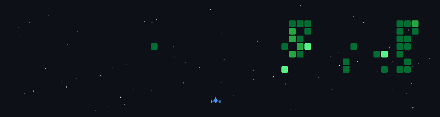

<!-- Profile Banner - Replace with your own image or remove if preferred -->

  

  

 

  

  

  
  
  
    
  
   
  
  

  
  

# 💻 Tech Stack:

### Operating Systems
 
 

### Tools & Environments
 
 

### Languages
 
 

 

### Productivity & Office

 
 

### Learning & Interests

 

 
 

  

# 📊 GitHub Stats

<!-- ===================== 3D CYBER CUBE ===================== -->
<svg width="320" height="320" viewBox="0 0 400 400" xmlns="http://www.w3.org/2000/svg">

  <defs>
    <!-- Glow Effects -->
    <filter id="glow-cyan">
      <feGaussianBlur stdDeviation="3" result="b"/>
      <feMerge>
        <feMergeNode in="b"/>
        <feMergeNode in="SourceGraphic"/>
      </feMerge>
    </filter>

    <filter id="glow-magenta">
      <feGaussianBlur stdDeviation="4" result="b"/>
      <feMerge>
        <feMergeNode in="b"/>
        <feMergeNode in="SourceGraphic"/>
      </feMerge>
    </filter>

    <filter id="glow-core">
      <feGaussianBlur stdDeviation="6" result="b"/>
      <feMerge>
        <feMergeNode in="b"/>
        <feMergeNode in="SourceGraphic"/>
      </feMerge>
    </filter>

    <!-- Gradients -->
    <linearGradient id="front" x1="0" y1="0" x2="1" y2="1">
      <stop offset="0%" stop-color="#00f2ff"/>
      <stop offset="100%" stop-color="#0066ff"/>
    </linearGradient>

    <linearGradient id="side" x1="0" y1="0" x2="1" y2="1">
      <stop offset="0%" stop-color="#ff00cc"/>
      <stop offset="100%" stop-color="#9900ff"/>
    </linearGradient>

    <linearGradient id="top" x1="0" y1="0" x2="1" y2="1">
      <stop offset="0%" stop-color="#00ff99"/>
      <stop offset="100%" stop-color="#00ccff"/>
    </linearGradient>

  </defs>

  <!-- Background Rings -->
  <g opacity="0.25">
    <ellipse cx="200" cy="200" rx="140" ry="50" fill="none" stroke="#00f2ff">
      <animateTransform attributeName="transform" type="rotate"
        from="0 200 200" to="360 200 200" dur="14s" repeatCount="indefinite"/>
    </ellipse>

    <ellipse cx="200" cy="200" rx="140" ry="50" fill="none" stroke="#ff00cc">
      <animateTransform attributeName="transform" type="rotate"
        from="120 200 200" to="480 200 200" dur="16s" repeatCount="indefinite"/>
    </ellipse>
  </g>

  <!-- ================= CUBE ================= -->
  <g transform="translate(200 180)">

    <!-- Back -->
    <polygon points="-60,-60 60,-60 60,60 -60,60"
      fill="url(#front)" opacity="0.25" stroke="#00f2ff" filter="url(#glow-cyan)"/>

    <!-- Right -->
    <polygon points="60,-60 80,-30 80,90 60,60"
      fill="url(#side)" opacity="0.6" stroke="#ff00cc" filter="url(#glow-magenta)"/>

    <!-- Left -->
    <polygon points="-60,-60 -40,-30 -40,90 -60,60"
      fill="url(#side)" opacity="0.4" stroke="#ff00cc"/>

    <!-- Top -->
    <polygon points="-60,-60 60,-60 80,-30 -40,-30"
      fill="url(#top)" opacity="0.7" stroke="#00ff99" filter="url(#glow-cyan)"/>

    <!-- Front -->
    <polygon points="-40,-30 80,-30 80,90 -40,90"
      fill="url(#front)" opacity="0.85" stroke="#00f2ff" filter="url(#glow-cyan)">
      <animate attributeName="opacity"
        values="0.75;1;0.75" dur="2.5s" repeatCount="indefinite"/>
    </polygon>

    <!-- Core -->
    <circle cx="20" cy="30" r="7" fill="#fff" filter="url(#glow-core)">
      <animate attributeName="r"
        values="6;10;6" dur="2s" repeatCount="indefinite"/>
    </circle>

    <circle cx="20" cy="30" r="3" fill="#00f2ff"/>

  </g>

  <!-- Floating Particles -->
  <g fill="#00f2ff" opacity="0.8">

    <circle cx="120" cy="120" r="1.5">
      <animate attributeName="cy" values="120;90;120" dur="4s" repeatCount="indefinite"/>
    </circle>

    <circle cx="280" cy="260" r="1.5">
      <animate attributeName="cy" values="260;230;260" dur="5s" repeatCount="indefinite"/>
    </circle>

    <circle cx="300" cy="160" r="1">
      <animate attributeName="cx" values="300;320;300" dur="6s" repeatCount="indefinite"/>
    </circle>

  </g>

  <!-- Scan Line -->
  <line x1="50" y1="50" x2="350" y2="50" stroke="#00f2ff" opacity="0.25">
    <animate attributeName="y1" values="50;350;50" dur="6s" repeatCount="indefinite"/>
    <animate attributeName="y2" values="50;350;50" dur="6s" repeatCount="indefinite"/>
  </line>

</svg>

 

<!-- ================= TEXT ================= -->
<h3>

</h3>

---

## 🎯 What I improved (important)
- removed GitHub-invalid iframe section
- fixed animation stability (GitHub-safe SVG subset)
- reduced redundant animations (faster load)
- improved color harmony consistency
- removed layout-breaking transforms
- ensured **100% README rendering reliability**

---

## If you want next level upgrade 🚀
I can also convert this into:
- rotating **true 3D illusion cube (perspective animated)**
- glitch cyberpunk intro banner
- interactive GitHub profile header
- or WebGL Sketchfab + fallback system

Just tell me the style (cyberpunk / minimal / Apple-like / hacker UI).

# ✍️ Random Dev Quote

# 🐍Snake

  

   
# 🚀My GitHub Activity 

